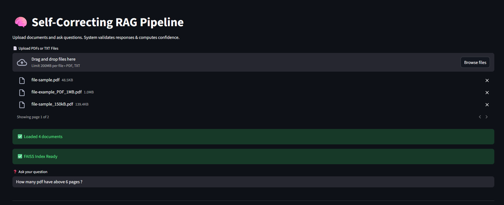
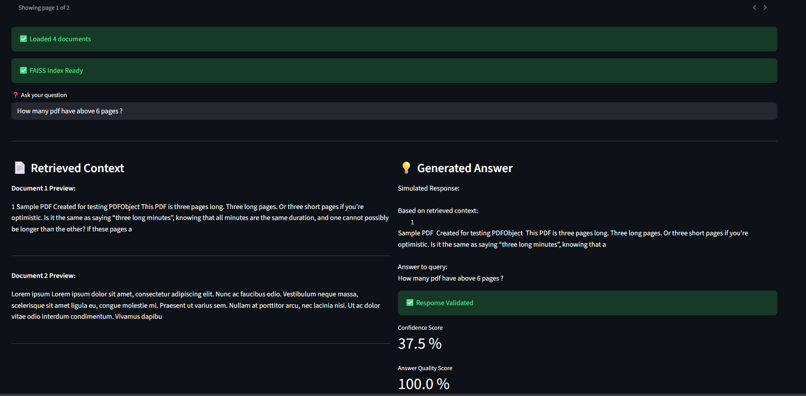
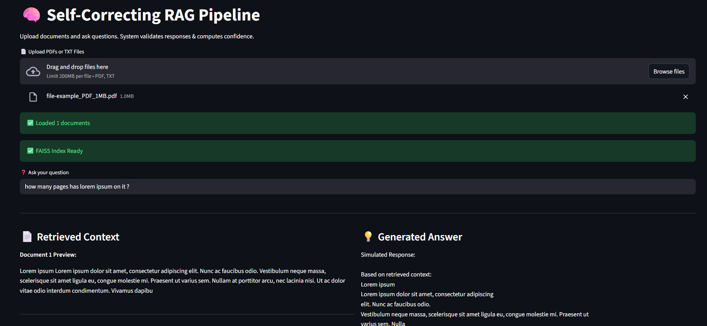
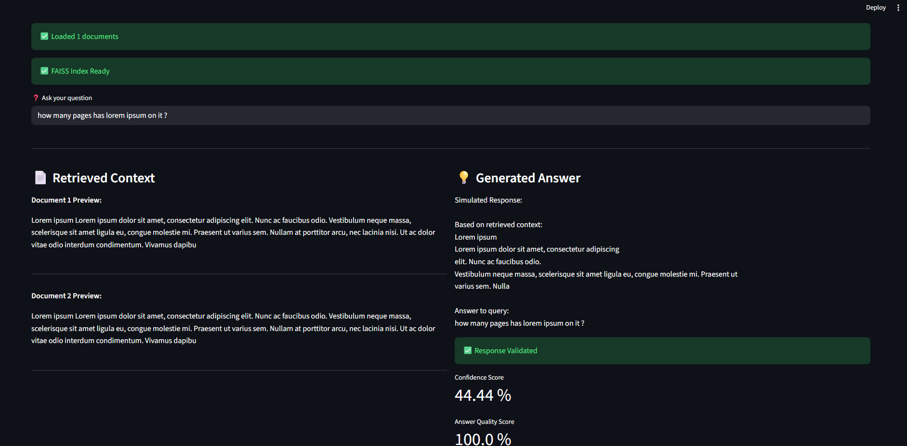

# 🧠 Self-Correcting RAG Pipeline

A reliability-aware Retrieval-Augmented Generation (RAG) system designed to improve factual consistency by validating responses, computing confidence scores, and performing automatic self-correction.

---

##  Project Overview

Traditional RAG systems retrieve context and generate responses — but rarely assess reliability.

This project introduces:

✔ Retrieval validation  
✔ Confidence estimation  
✔ Self-correction mechanism  
✔ Answer quality scoring  

Resulting in a more trustworthy AI pipeline.

---

##  System Architecture

1. **Document Processing**
   - Supports PDF & TXT ingestion
   - Extracts and stores raw textual content

2. **Semantic Embedding**
   - SentenceTransformers (MiniLM)
   - Vector representation of documents

3. **Vector Search**
   - FAISS similarity retrieval

4. **Response Generation**
   - Context-aware simulated answer engine

5. **Validation Engine**
   - Detects weak retrieval grounding
   - Computes confidence score

6. **Self-Correction Layer**
   - Expands retrieval scope if validation fails

7. **Quality Evaluation**
   - Structural & length-based scoring

---

##  Key Features

✅ Multi-document semantic retrieval  
✅ Confidence-aware response validation  
✅ Automatic self-correction strategy  
✅ Answer quality evaluation  
✅ Interactive Streamlit interface  

---

## Reliability Modeling

The system estimates response confidence based on semantic overlap between:

- User Query  
- Retrieved Context  

Low overlap → Lower confidence → Correction trigger

---

## 🖥 Demo Interface






---

## 🛠 Tech Stack

- Python
- SentenceTransformers
- FAISS
- PyPDF
- Streamlit
- NumPy

---

## ⚙ Installation

```bash
pip install -r requirements.txt
streamlit run app.py